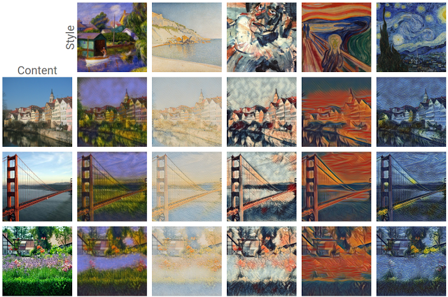

# Neural-Style-Transfer
A project that was made to replicate work done by Gatys et al, [A Neural Algorithm of Artistic Style
](https://arxiv.org/pdf/1508.06576.pdf).

## Overview
Neural style transfer (NST) is a technique that takes two images — a content image and a style reference image — and blends them together so that the output looks like the content image, but painted in the style of the style reference image.

The aim of this project is to understand how NST works by reconstructing the original paper on neural style transfer (Gatys et al.).
This repo contains a concise Tensorflow implementation [code](https://github.com/thepavankoushik/Neural-Brew/blob/master/nst.py) using VGG-19 net.

## Examples

## Acknowledgements
- The original paper [A Neural Algorithm of Artistic Style](https://arxiv.org/abs/1508.06576) by Gatys et al.
- The original paper [Exploring the Neural Algorithm of Artistic Style](https://arxiv.org/abs/1602.07188).
- The original paper on [VGG Nets](https://arxiv.org/abs/1409.1556).